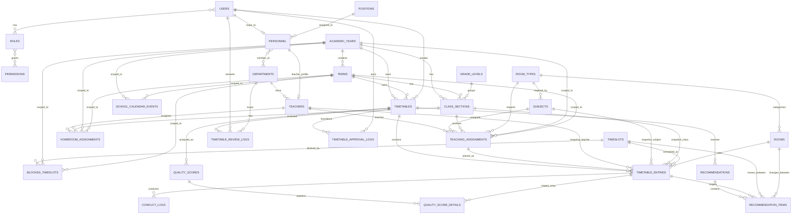

# ERD.md

## Purpose
ERD นี้เป็นฉบับ proposal/MVP สำหรับระบบวิเคราะห์และเพิ่มประสิทธิภาพตารางสอนโรงเรียน โดยเน้น Manual Timetable, Conflict Checker, Lightweight Approval Workflow, Blocked Timeslot, School Calendar Warning, Quality Score และ Recommendation

## MVP ERD

## Core Entity Groups
| Group | Tables | Purpose |
|---|---|---|
| Identity & RBAC | users, roles, permissions, role_user | login และสิทธิ์ตามบทบาท |
| Personnel | personnel, positions, departments, department_members, teachers | บุคลากร ครู และกลุ่มสาระ |
| Academic Setup | academic_years, terms, grade_levels, class_sections, timeslots | ปี/เทอม ห้องเรียน และคาบเรียน |
| Teaching Setup | subjects, room_types, rooms, homeroom_assignments, teaching_assignments | ข้อมูลก่อนจัดตาราง |
| Calendar Rules | blocked_timeslots, school_calendar_events | คาบห้ามจัดและกิจกรรมโรงเรียน |
| Timetable | timetables, timetable_entries | ตาราง draft/published และรายการคาบ |
| Approval | timetable_review_logs, timetable_approval_logs | review, return, approve, publish |
| Analysis | conflict_logs, quality_scores, quality_score_details | conflict และ quality score |
| Recommendation | recommendations, recommendation_items | ข้อเสนอพร้อม predicted after score |
| Audit/AI | audit_logs, ai_prompt_logs | บันทึกการเปลี่ยนแปลงและ optional AI logs |

## Important Modeling Decisions
- `timetables.status` ใช้ lifecycle: `draft`, `submitted`, `returned`, `approved`, `published`, `archived`
- `timetable_entries.teacher_id`, `subject_id`, `class_section_id` เป็น snapshot จาก `teaching_assignments`
- MVP รองรับครูหลัก 1 คนต่อ timetable entry
- MVP ไม่รองรับ split class หรือ subgroup
- `blocked_timeslots.severity = blocked` เป็น hard conflict
- `school_calendar_events.severity = warning` เป็นค่าเริ่มต้น
- Hard conflict เป็น publish gate
- Recommendation ใช้ `predicted_after_score` ไม่ใช่การแก้ตารางอัตโนมัติ

## Suggested Constraints
- Unique active timetable name per academic year and term
- Unique class section + timeslot per timetable
- Prevent publish when hard conflict count > 0
- Require return reason when approval action is `return`
- Validate snapshot fields in `timetable_entries` against selected `teaching_assignment`
- Prevent new references to inactive master data

## Future Extensions
- `timetable_entry_teachers` สำหรับ co-teaching
- `class_section_groups` สำหรับ split class
- `teacher_unavailabilities`
- Full auto timetable generator run tables
- Excel export templates
